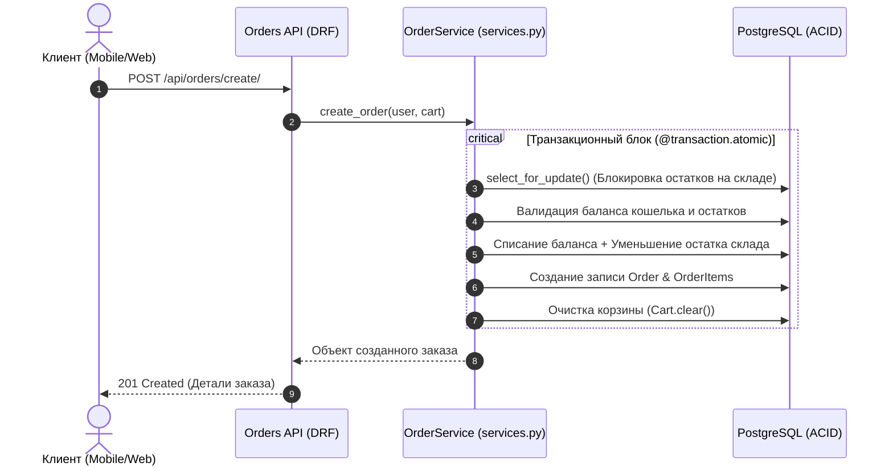

<div align="center">

  

  <p align="center">
    <b>Масштабируемый REST API сервис интернет-магазина с изолированным слоем сервисов, JWT-авторизацией и транзакционным контролем склада</b>
  </p>
  <p align="center">
    
    
    
    
    
    
  </p>
</div>

---

### 📌 О проекте

**MarketFlow** — полнофункциональный e-commerce бэкенд-сервис, спроектированный с учетом требований к надежности финансовых операций и параллельной обработке заказов. Сервис решает ключевые задачи онлайн-ритейла: управление каталогом, корзинами, балансом пользователей и атомарным резервированием товарных остатков при высоких нагрузках.

---

### 🛡️ Архитектурные паттерны & Особенности

* 🧱 **Изоляция бизнес-логики (Services Layer):** контроллеры (`views.py`) остаются тонкими — все транзакции и операции проводятся через выделенный слой `services.py`.
* 🔒 **Гарантия ACID и защита от Race Conditions:** оформление покупок выполняется строго внутри `@transaction.atomic` с пессимистической блокировкой строк инвентаря через `select_for_update()`. Исключает овербукинг и покупку товаров «в минус».
* 🔑 **Безопасность и сессии:** JWT-авторизация (Access / Refresh токены) на базе `simplejwt` с разграничением прав доступа (RBAC).
* 📜 **Аудит и логирование:** запись всех ключевых событий и финансовых транзакций в консоль и физический файл `orders.log`.
* 📖 **OpenAPI 3.0 Спецификация:** автогенерация документации и песочницы Swagger UI с помощью `drf-spectacular`.

---

### 🔄 Механика безопасного заказа (Transactional Flow)



---

### 🛠️ Стек технологий

| Слой | Стек | Назначение |
| :--- | :--- | :--- |
| **Backend Core** | Python 3.11+, Django 4+, DRF | Ядро API, сериализаторы, permissions |
| **Database** | PostgreSQL, Django ORM | Реляционное хранилище с ACID-гарантиями |
| **Auth** | JWT (simplejwt) | Безопасная аутентификация |
| **Docs** | drf-spectacular (Swagger UI) | Интерактивная песочница и OpenAPI схема |
| **DevOps & Tests** | Docker, Docker Compose, unittest | Контейнеризация и интеграционные тесты |

---

### 📄 Эндпоинты API

| Метод | Эндпоинт | Описание | Доступ |
| :--- | :--- | :--- | :--- |
| `POST` | `/api/users/register/` | Регистрация нового пользователя | Public |
| `POST` | `/api/token/` | Получение пары JWT-токенов | Public |
| `GET` | `/api/users/profile/` | Просмотр профиля и баланса | Authenticated |
| `POST` | `/api/users/balance/topup/` | Пополнение внутреннего кошелька | Authenticated |
| `GET` | `/api/products/` | Каталог товаров магазина | Public |
| `POST` | `/api/products/` | Создание новой товарной позиции | Staff / Admin |
| `GET` | `/api/cart/` | Просмотр состава корзины | Authenticated |
| `POST` | `/api/cart/` | Добавление товара в корзину | Authenticated |
| `POST` | `/api/orders/create/` | Оформление заказа и списание средств | Authenticated |
| `GET` | `/api/docs/` | Интерактивный Swagger UI | Public |

---

### 🚀 Быстрый старт в Docker

#### 1. Подготовка конфигурации (.env)

Создайте файл `.env` в корне проекта:

```env
SECRET_KEY=production_ready_django_secret_key_12345
DEBUG=True
ALLOWED_HOSTS=*

DB_NAME=marketflow_db
DB_USER=postgres
DB_PASSWORD=postgres_secure_pass
DB_HOST=db
DB_PORT=5432
```

#### 2. Сборка и запуск сервисов

```bash
docker compose up --build
```

- **API:** `http://localhost:8000/api/`
- **Swagger UI:** `http://localhost:8000/api/docs/`

---

### 🧪 Запуск автоматических тестов

Интеграционные тесты покрывают критические сценарии: конкурентные покупки, нехватку денег на балансе и дефицит остатков на складе:

```bash
docker compose exec web python manage.py test
```

---

### 📂 Структура проекта

```plaintext
├── config/                  # Конфигурация Django и глобальный роутинг
│   ├── settings.py          # Базовые настройки, JWT, логи, spectacular
│   ├── urls.py              # Реестр маршрутов API
│   ├── wsgi.py              # WSGI-конфиг
│   └── asgi.py              # ASGI-конфиг
├── apps/                    # Бизнес-модули
│   ├── users/               # Модель пользователя, баланс, профили
│   ├── products/            # Каталог, категории, остатки на складе
│   └── orders/              # Корзина, транзакции и слой services.py
├── tests/                   # Интеграционные тесты
├── Dockerfile               # Контейнеризация Django API
├── docker-compose.yml       # Оркестрация web-сервиса и PostgreSQL
└── manage.py                # CLI-менеджер Django
```
